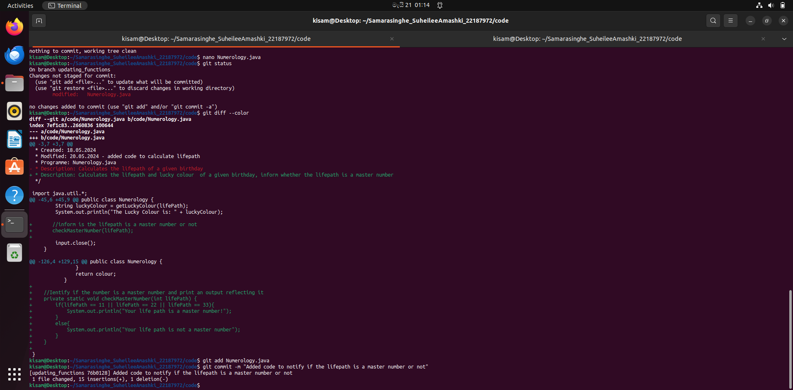
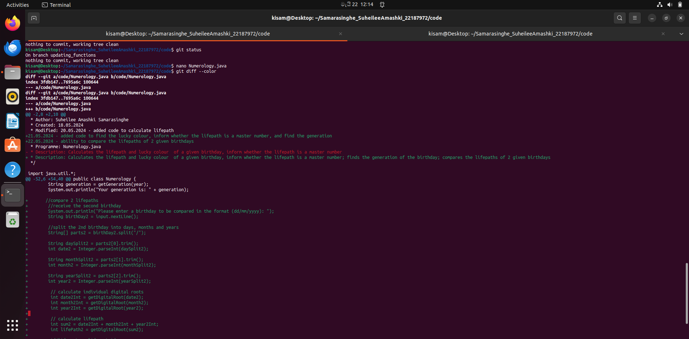
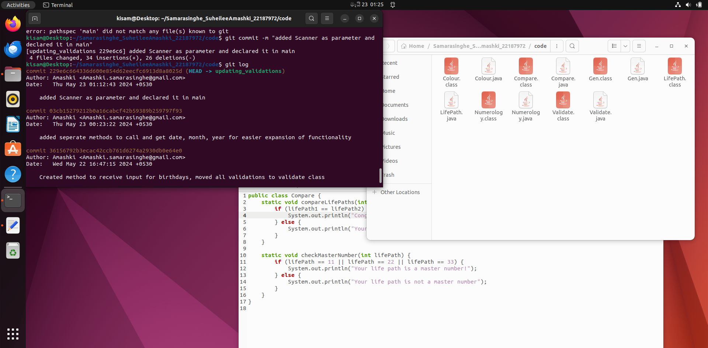
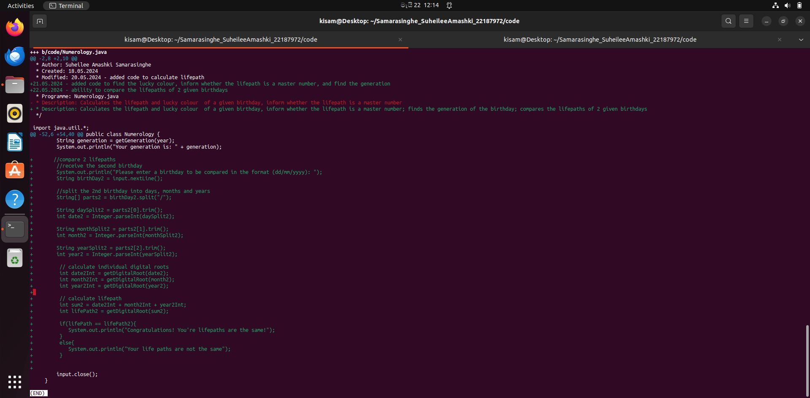
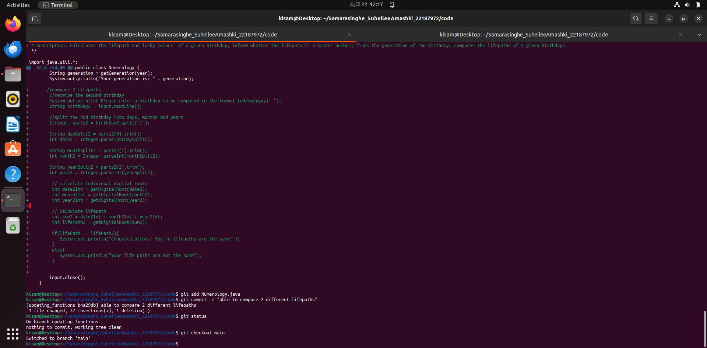
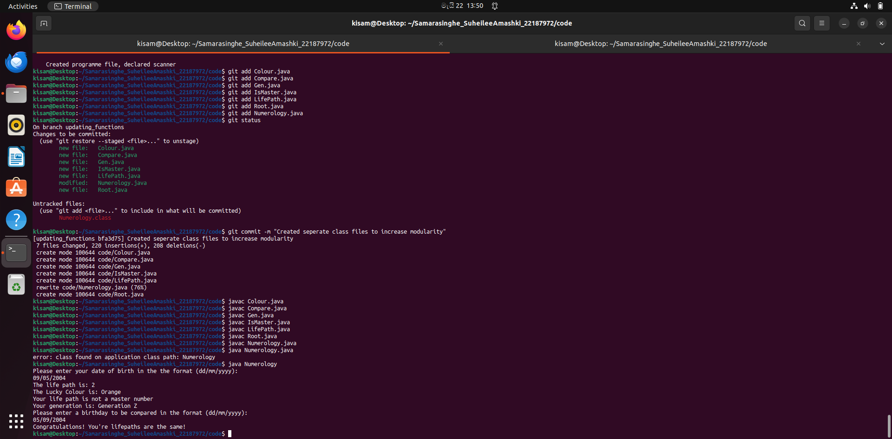
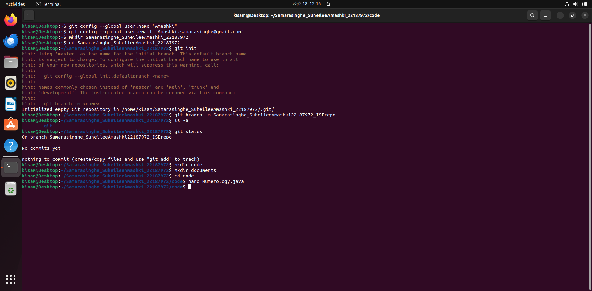
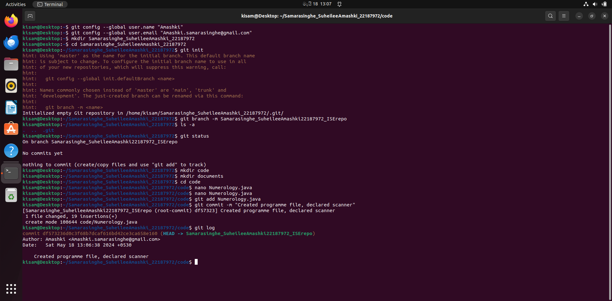
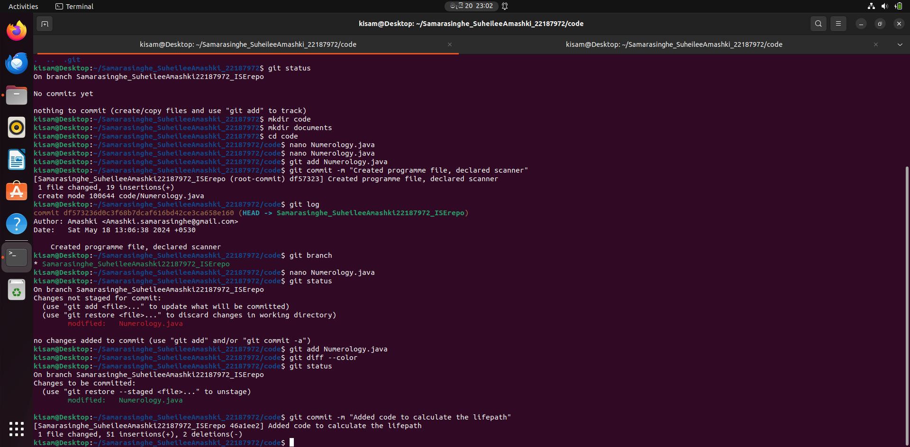
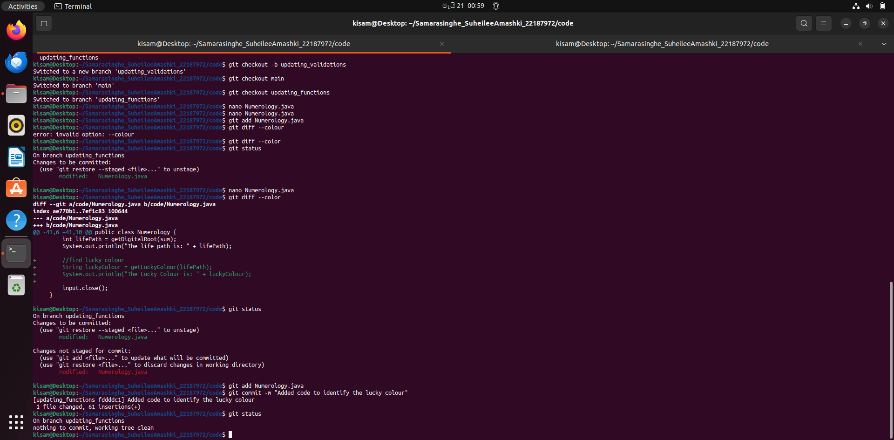

# Numerology Program Testing Report

## Introduction

This document details the testing strategies and results for a numerology program implemented in Java. The program prompts the user to input their birthday and, based on the input, calculates various numerological aspects such as life path number, lucky color, master numbers, and generational categorization. Additionally, the program allows comparison of life path numbers for two different birthdays.

## Module Descriptions

### getBirthDay
- **Import**: `Scanner input`
- **Export**: `String birthday`
- **Description**: Prompts the user for the birthday, ensures that the user enters a non-empty String, and returns the value to the main program.

### getDate
- **Import**: `String birthday`, `Scanner input`
- **Export**: `int date`
- **Description**: Splits the birthday string and assigns the first part to the date variable. Ensures that the variable is valid (between 1 and 31). If it is not valid, sends an error message and asks to re-enter the date. Returns the valid date integer.

### getMonth
- **Import**: `String birthday`, `Scanner input`
- **Export**: `int month`
- **Description**: Splits the birthday string and assigns the second part to the month. If the month is given in letters, calls the `monthToInt` function to convert it to a number. Ensures that the month is between 1 and 12; if invalid, prompts the user to input the correct month. Returns the valid month integer.

### getYear
- **Import**: `String birthday`, `Scanner input`
- **Export**: `int year`
- **Description**: Splits the birthday string and assigns the final part to the year. Ensures the year is between 1901 and 2024. If invalid, prompts the user to input the correct year. Returns the valid year integer.

### monthToInt
- **Import**: `String month`
- **Export**: `int month`
- **Description**: Converts the relevant month given in words to the corresponding digit. Returns the valid month integer.

### getDigitalRoot
- **Import**: `int date`
- **Export**: `int root`
- **Description**: Finds the sum of the integers of the given import value by dividing the variable by 10 and adding the modulus to the sum (root). If the root reaches 11, 22, or 33, returns the root value without reducing. Else, repeats the loop till the root is a single digit. Returns the root.

### calcLifePath
- **Import**: `int date`, `int month`, `int year`
- **Export**: `int lifePath`
- **Description**: Calculates the life path by calling the `getDigitalRoot` function to identify the individual digital roots of the date, month, and year. Then finds the sum and its digital root; assigns it to the life path variable. Returns the life path variable.

### getLuckyColour
- **Import**: `int lifePath`
- **Export**: `String luckyColour`
- **Description**: When given a particular life path, returns the relevant lucky color.

### checkMasterNumber
- **Import**: `int lifePath`
- **Export**: `none`
- **Description**: Checks if the life path is a master number (11, 22, or 33); and outputs the result to display.

### getGeneration
- **Import**: `int year`
- **Export**: `String generation`
- **Description**: Returns the relevant generation for the given year.

### compareLifePaths
- **Import**: `int lifePath1`, `int lifePath2`
- **Export**: `none`
- **Description**: Checks if the two given life paths are equal, and sends the result to display.

# Review Checklist

## Module: calcLifePath

- Does the module perform only one task?  
  **Yes**

- Does the module take in only the essential parameters?  
  **Yes**

- Does the module not use any global variables?  
  **Yes**

- Does the module have sufficient comments to explain its functions?  
  **Yes**

- Does the module have a clear input(s)?  
  **Yes**

- Does the module have a clear output?  
  **Yes**

- Does the module handle all possible inputs?  
  **No:** it is assumed the date, month, and year will already have been validated, and only the expected input is considered

- Does the module have a loose coupling?  
  **Yes**

## Module: Digital Root

- Does the module perform only one task?  
  **Yes**

- Does the module take in only the essential parameters?  
  **Yes**

- Does the module not use any global variables?  
  **Yes**

- Does the module have sufficient comments to explain its functions?  
  **Yes**

- Does the module have a clear input(s)?  
  **Yes**

- Does the module have a clear output?  
  **Yes**

- Does the module handle all possible inputs?  
  **No:** it is assumed the date, month, and year will already have been validated, and only the expected input is considered

- Does the module have a loose coupling?  
  **Yes**

## Module: monthToInt

- Does the module perform only one task?  
  **Yes**

- Does the module take in only the essential parameters?  
  **Yes**

- Does the module not use any global variables?  
  **Yes**

- Does the module have sufficient comments to explain its functions?  
  **Yes**

- Does the module have a clear input(s)?  
  **Yes**

- Does the module have a clear output?  
  **Yes**

- Does the module handle all possible inputs?  
  **No:** however, the method is called in conjunction with a try/catch clause

- Does the module have a loose coupling?  
  **Yes**

## Module: getMonth

- Does the module perform only one task?  
  **Yes**

- Does the module take in only the essential parameters?  
  **Yes**

- Does the module not use any global variables?  
  **Yes**

- Does the module have sufficient comments to explain its functions?  
  **Yes**

- Does the module have a clear input(s)?  
  **Yes**

- Does the module have a clear output?  
  **Yes**

- Does the module handle all possible inputs?  
  **Yes**

- Does the module have a loose coupling?  
  **Yes**

## Module: getDate

- Does the module perform only one task?  
  **Yes**

- Does the module take in only the essential parameters?  
  **Yes**

- Does the module not use any global variables?  
  **Yes**

- Does the module have sufficient comments to explain its functions?  
  **Yes**

- Does the module have a clear input(s)?  
  **Yes**

- Does the module have a clear output?  
  **Yes**

- Does the module handle all possible inputs?  
  **Yes**

- Does the module have a loose coupling?  
  **Yes**

## Module: getYear

- Does the module perform only one task?  
  **Yes**

- Does the module take in only the essential parameters?  
  **Yes**

- Does the module not use any global variables?  
  **Yes**

- Does the module have sufficient comments to explain its functions?  
  **Yes**

- Does the module have a clear input(s)?  
  **Yes**

- Does the module have a clear output?  
  **Yes**

- Does the module handle all possible inputs?  
  **Yes**

- Does the module have a loose coupling?  
  **Yes**

## Module: getBirthDay

- Does the module perform only one task?  
  **Yes**

- Does the module take in only the essential parameters?  
  **Yes**

- Does the module not use any global variables?  
  **Yes**

- Does the module have sufficient comments to explain its functions?  
  **Yes**

- Does the module have a clear input(s)?  
  **Yes**

- Does the module have a clear output?  
  **Yes**

- Does the module handle all possible inputs?  
  **Yes**

- Does the module have a loose coupling?  
  **Yes**

## Module: getGeneration

- Does the module perform only one task?  
  **Yes**

- Does the module take in only the essential parameters?  
  **Yes**

- Does the module not use any global variables?  
  **Yes**

- Does the module have sufficient comments to explain its functions?  
  **Yes**

- Does the module have a clear input(s)?  
  **Yes**

- Does the module have a clear output?  
  **Yes**

- Does the module handle all possible inputs?  
  **No:** it is assumed the year is a valid integer

- Does the module have a loose coupling?  
  **Yes**

## Module: CompareLifePaths

- Does the module perform only one task?  
  **Yes**

- Does the module take in only the essential parameters?  
  **Yes**

- Does the module not use any global variables?  
  **Yes**

- Does the module have sufficient comments to explain its functions?  
  **Yes**

- Does the module have a clear input(s)?  
  **Yes**

- Does the module have a clear output?  
  **Yes**

- Does the module handle all possible inputs?  
  **No:** it is assumed both life paths will be integers

- Does the module have a loose coupling?  
  **Yes**

## Module: checkMasterNumber

- Does the module perform only one task?  
  **Yes**

- Does the module take in only the essential parameters?  
  **Yes**

- Does the module not use any global variables?  
  **Yes**

- Does the module have sufficient comments to explain its functions?  
  **Yes**

- Does the module have a clear input(s)?  
  **Yes**

- Does the module have a clear output?  
  **Yes**

- Does the module handle all possible inputs?  
  **No:** It is assumed that the life path number will be an integer

- Does the module have a loose coupling?  
  **Yes**

# Changes Made

The module ‘Life Path’ initially received only the “birthday” string, split the string into the 3 variables Date, Month, Year; converted to integers and carried the calculations.
After the initial checklist review, the module was broken down, and “getDate, getMonth, getYear” modules were created; to be used as parameters for the ‘Lifepath’ module. This ensures that the LifePath module only performs 1 function.

# Black Box Testing - Equivalence Partitioning

## Module: getBirthday

| Category           | Test Input   | Expected Output                                |
|---------------------|--------------|------------------------------------------------|
| birthday is empty   | ""           | "Birthday cannot be empty. Please re-enter: " |
| Valid birthday      | "5/8/2004"   | String birthday = "5/8/2004"                  |

## Module: getDate

| Category            | Test Input   | Expected Output                                      |
|----------------------|--------------|------------------------------------------------------|
| date between 1 - 31  | 24           | int date = 24                                        |
| date less than 1     | -9           | "Date cannot be less than 1. Please re-enter your date only: " |
| date more than 31    | 54           | "Date cannot be more than 31. Please re-enter your date only: " |

## Module: getMonth

| Category               | Test Input   | Expected Output                                           |
|-------------------------|--------------|-----------------------------------------------------------|
| month between 1 - 12    | 6            | int month = 6                                              |
| month less than 1       | -9           | "Month cannot be negative. Please re-enter the month only: " |
| month more than 12      | 54           | "Month cannot be more than 12. Please re-enter the month only: " |
| month is a valid string | "June"       | int month = 6                                              |
| month is an invalid string | "String"   | "Invalid Input: String. Please re-enter your month only: " |

## Module: getYear

| Category                      | Test Input   | Expected Output                                                |
|--------------------------------|--------------|----------------------------------------------------------------|
| year between 1901 - 2024      | 2003         | int year = 2003                                                 |
| year less than 1901           | 1505         | "Year should not be before 1901. Please re-enter your year only: " |
| year more than 2024           | 2054         | "Year cannot be after 2024. Please re-enter your year only: "    |

## Module: monthToInt

| Category                 | Test Input   | Expected Output |
|---------------------------|--------------|-----------------|
| Valid month in Strings; full name | "January" | 1               |
| valid month in short form | "Dec"        | 12              |
| invalid month (nonsense string) | "fsdf" | 0                 |

## Module: getDigitalRoot

| Category          | Test Input   | Expected Output |
|--------------------|--------------|-----------------|
| Single digit       | 5            | 5               |
| Multiple digits    | 38           | 2               |
| Master number      | 11           | 11              |

## Module: calcLifePath

| Category                        | Test Input (date, month, year) | Expected Output |
|----------------------------------|---------------------------------|-----------------|
| valid input                      | 12, 3, 1992                    | 9               |
| master number                    | 22, 9, 2000                    | 33              |

## Module: getLuckyColour

| Category               | Test Input | Expected Output |
|-------------------------|------------|-----------------|
| valid lifepath          | 3          | Yellow          |
| valid master lifepath   | 22         | White           |

## Module: checkMasterNumber

| Category          | Test Input | Expected Output                         |
|--------------------|------------|-----------------------------------------|
| master number      | 11         | Message indicating it is a master number |
| not a master number| 4          | no output                               |

## Module: getGeneration

| Category       | Test Input | Expected Output     |
|-----------------|------------|---------------------|
| 1901 - 1945     | 1940       | Silent Generation   |
| 1946 - 1964     | 1957       | Baby Boomers        |
| 1965 - 1979     | 1972       | Generation X        |
| 1980 - 1994     | 1991       | Millenials          |
| 1995 - 2009     | 2004       | Generation Z        |
| 2010 - 2024     | 2013       | Generation Alpha    |

## Module: compareLifePaths

| Category           | Test Input (lifepath1, lifepath2) | Expected Output |
|---------------------|----------------------------------|-----------------|
| equal lifepaths     | 5, 5                             | Equal           |
| not equal           | 4, 6                             | Not equal       |

  
# BVA Analysis

## Module: getDate BVA

| Boundary  | Test Data      | Expected Output                                             |
|-----------|----------------|-------------------------------------------------------------|
| < 01      | "00/01/2004"   | "Date cannot be less than 1. Please re-enter your date only: " |
| >= 1      | "01/01/2004"   | 1                                                           |
| <= 31     | "31/01/2004"   | 31                                                          |
| > 31      | "32/01/2004"   | "Date cannot be more than 31. Please re-enter your date only: " |

## Module: getYear BVA

| Boundary  | Test Data      | Expected Output                                                 |
|-----------|----------------|-----------------------------------------------------------------|
| < 1901    | "04/03/1900"   | "Year should not be before 1901. Please re-enter your year only: " |
| >= 1901   | "04/03/1901"   | 1901                                                            |
| <= 2024   | "04/03/2024"   | 2024                                                            |
| > 2024    | "04/03/2025"   | "Year cannot be after 2024. Please re-enter your year only: "    |

## Module: getMonth BVA

| Boundary  | Test Data      | Expected Output                                            |
|-----------|----------------|------------------------------------------------------------|
| < 01      | "01/00/2004"   | "Month cannot be negative. Please re-enter the month only: " |
| >= 1      | "01/01/2004"   | 1                                                          |
| <= 12     | "01/12/2004"   | 12                                                         |
| > 12      | "01/13/2004"   | "Month cannot be more than 12. Please re-enter the month only: " |

# White-Box Testing Design Report

## getDate

### Test Cases

| Test Case                         | Input         | Expected Output                                                |
|-----------------------------------|---------------|----------------------------------------------------------------|
| Valid date within range.          | "15/01/2004"  | 15                                                             |
| Date less than 1.                 | "00/01/2004"  | IllegalArgumentException("Date cannot be less than 1")         |
| Date greater than 31.             | "32/01/2004"  | IllegalArgumentException("Date cannot be more than 31")        |

## getMonth

### Test Cases

| Test Case                         | Input             | Expected Output                                                |
|-----------------------------------|-------------------|----------------------------------------------------------------|
| Valid month between 1 and 12.     | "01/05/2004"      | 5                                                              |
| Month less than 1.                | "01/00/2004"      | IllegalArgumentException("Month cannot be negative or zero")    |
| Month greater than 12.            | "01/7972/2004"    | IllegalArgumentException("Month cannot be more than 12")        |
| Valid month name.                 | "01/June/2004"    | 6                                                              |
| Invalid month name.               | "01/Samarasinghe/2004" | IllegalArgumentException("Invalid month: Samarasinghe")         |

### Discussion
White-box testing is beneficial for these modules because they contain control structures such as conditional statements and loops, making it important to ensure all paths are covered.

## Traceability Matrix

### Design of Test Cases

| Module Name         | BB (EP) | BB (BVA) | WB   | Data Type(s)        | Form of Input/Output         |
|---------------------|---------|----------|------|---------------------|------------------------------|
| getBirthday         | Done    | N/A      | N/A  | String              | String (keyboard input/output) |
| getDate             | Done    | Done     | Done | int, String         | String (keyboard input/output) |
| getMonth            | Done    | Done     | Done | int, String         | String (keyboard input/output) |
| getYear             | Done    | Done     | N/A  | int, String         | String (keyboard input/output) |
| monthToInt          | Done    | N/A      | N/A  | String, int         | String / int                  |
| getDigitalRoot      | Done    | N/A      | N/A  | int                 | int (return value)            |
| calcLifePath        | Done    | N/A      | N/A  | int                 | int (return value)            |
| getLuckyColour      | Done    | N/A      | N/A  | int                 | String (return value)         |
| checkMasterNumber   | Done    | N/A      | N/A  | int                 | void (console output)         |
| getGeneration       | Done    | N/A      | N/A  | int                 | String (return value)         |
| compareLifePaths    | Done    | N/A      | N/A  | int                 | String (return value)         |

## Test Code Implementation and Execution

| Module Name         | BB (EP) | BB (BVA) | WB   |
|---------------------|---------|----------|------|
| getBirthday         | Done    | N/A      | N/A  |
| getDate             | Done    | Done     | Done |
| getMonth            | Done    | Done     | Done |
| getYear             | Done    | Done     | N/A  |
| monthToInt          | Done    | N/A      | N/A  |
| getDigitalRoot      | Done    | N/A      | N/A  |
| calcLifePath        | Done    | N/A      | N/A  |
| getLuckyColour      | Done    | N/A      | N/A  |
| checkMasterNumber   | Done    | N/A      | N/A  |
| getGeneration       | Done    | N/A      | N/A  |
| compareLifePaths    | Done    | N/A      | N/A  |

## Version Control

As attached. However, there were issues with committing the final work and documentation due to an ongoing error in the virtual machine.

## Discussion

I have successfully written and maintained the code with version control to ensure all changes are well documented. Adequate testing has been conducted. Despite encountering obstacles due to laptop and software issues, I aim to identify and prevent such issues in the future. This assignment was both challenging and interesting.
